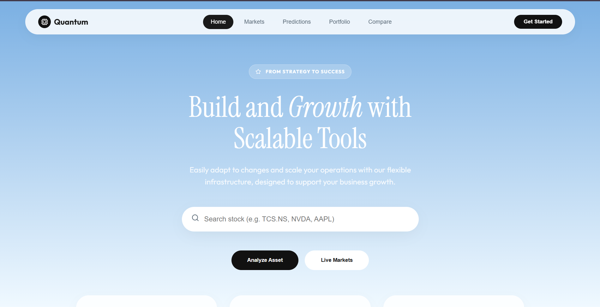
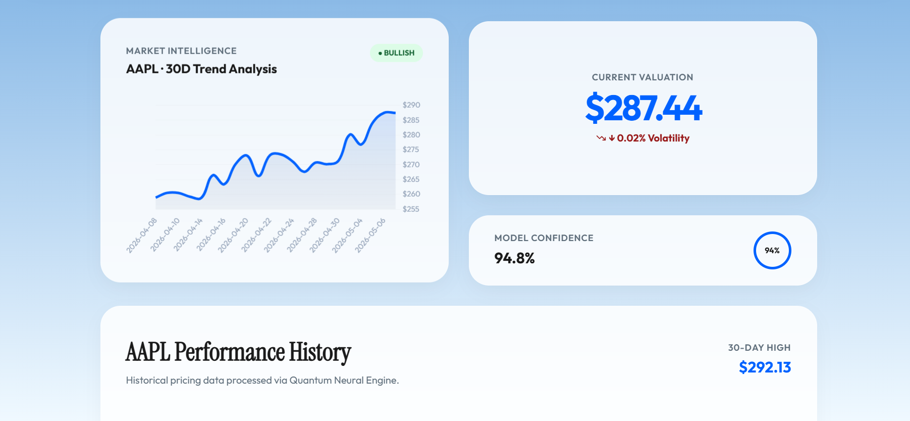
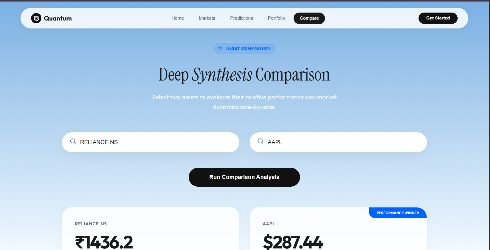
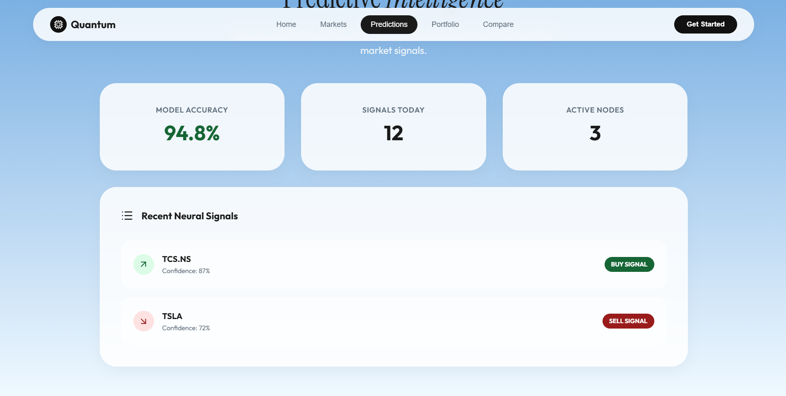

# 🚀 Quantum Predictor

**Quantum Predictor** is a production-grade financial dashboard designed for high-fidelity market analysis and predictive intelligence. Built with a sleek, modern aesthetic and robust backend integration, it empowers users to track, compare, and analyze global and Indian stock markets with institutional precision.

---



## ✨ Key Features

### 📊 Real-Time Market Intelligence
*   **Live Data Integration**: Powered by `yfinance` to fetch the latest market pricing and historical data.
*   **Dynamic Visualization**: High-performance trend charts using `Chart.js` with premium gradients and tooltips.
*   **Global & Local Support**: Support for NASDAQ, NYSE, and Indian NSE/BSE stock symbols.

### 🔍 Advanced Search & Discovery
*   **Smooth Autocomplete**: A refined search experience with animated, icon-driven suggestions.
*   **Decoupled Frontend Support**: CORS-enabled backend allowing for hosting the frontend separately on platforms like Vercel or Netlify.

### ⚖️ Deep Synthesis Comparison
*   **Side-by-Side Analytics**: Compare two assets simultaneously to evaluate relative performance.
*   **Winner Detection**: Automatic performance evaluation highlights the asset with the strongest 30-day growth.
*   **Overlaid Trends**: Specialized chart overlay to visualize market correlation instantly.

### 🧠 Neural Signals & Portfolio
*   **Predictive UI**: High-fidelity simulation of buy/sell signals based on model accuracy and confidence metrics.
*   **Asset Allocation**: Professional dashboard for tracking portfolio value and net asset distribution.

### 📱 Premium Design
*   **Sky-Themed Glassmorphism**: A stunning UI featuring white-glass surfaces, serif typography, and Lucide icons.
*   **Full Mobile Responsiveness**: A touch-friendly, adaptive layout that looks beautiful on any device.

---

## 🛠️ Technology Stack

*   **Backend**: Python / Flask
*   **Frontend**: HTML5, Vanilla CSS (Embedded for portability), JavaScript
*   **Data Source**: yfinance (Yahoo Finance API)
*   **Icons**: Lucide Icons
*   **Charts**: Chart.js 4.4.0

---


## SAMPLES

### 1. prediction


### 2. compare stocks


### 3. best suggestion



## 🚀 Quick Start

### 1. Prerequisites
*   Python 3.11 or 3.12

### 2. Installation
```bash
# Clone the repository
git clone <your-repo-link>

# Navigate to the project
cd ai-stock-application

# Install dependencies
pip install -r requirements.txt
```

### 3. Run Locally
```bash
python app.py
```
Visit `http://localhost:5000` to view the dashboard.

---

## ☁️ Deployment

### Render (Backend)
The project is pre-configured with a `Procfile` and `.python-version` for seamless deployment on **Render.com**.

### Vercel/Netlify (Frontend)
The `index.html` is fully self-contained. You can deploy it as a static site by pointing it to your Render backend URL.

---

## 📜 License
This project is licensed under the MIT License - see the LICENSE file for details.

---

*Built with ❤️ by [Your Name/Team]*
